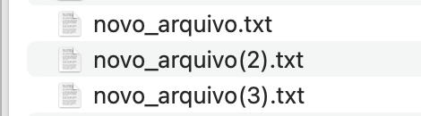
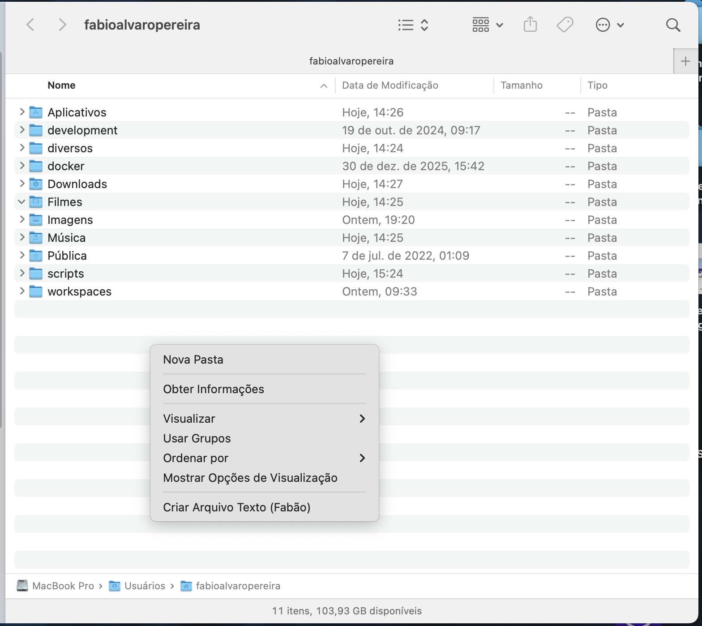

# 📂 FabaoFileMenu - Finder Extension

Uma extensão nativa para macOS que adiciona a opção **"Criar Arquivo Texto"** ao menu de contexto (botão direito) do Finder.


Novos arquivos adicionados...



Menu de contexto para adicionar novo arquivo....

> **Nota:** Este projeto é uma Proof of Concept (PoC) para demonstrar como superar as restrições de Sandbox do macOS e manipular arquivos diretamente via extensão do Finder.

## 🚀 Funcionalidades

- 🖱️ **Integração Nativa:** Aparece no menu de clique direito dentro das pastas.
- 📄 **Criação Rápida:** Cria um arquivo `novo_arquivo.txt` instantaneamente.
- 🔄 **Lógica de Colisão:** Se o arquivo já existir, cria automaticamente sequencialmente: `novo_arquivo(2).txt`, `novo_arquivo(3).txt`, etc.
- 🔊 **Feedback Sonoro:** Emite um som de sistema ("Bip") ao concluir a ação com sucesso.
- 🔓 **Bypass de Sandbox:** Utiliza *Entitlements* específicos para permitir escrita na pasta do usuário.

## ⚠️ Pré-requisitos de Ambiente

Antes de baixar o código, certifique-se de que você tem o ambiente de desenvolvimento Apple pronto na sua máquina.

1. **Xcode Instalado:**
   Você precisa do Xcode completo para compilar o projeto. Disponível gratuitamente na [Mac App Store](https://apps.apple.com/br/app/xcode/id497799835).
   
2. **Git:**
   Necessário para clonar o repositório (geralmente já vem instalado no macOS).

## 🛠️ Instalação e Configuração

### 1. Clonar o Repositório
Abra o terminal e baixe o código:

```bash
git clone git@github.com:slackwarecps/finder-menu-extension.git
cd finder-menu-extension
```

### 2. Configuração Obrigatória (Atenção ⚠️)
Como este projeto utiliza um caminho absoluto para driblar o Sandbox, você precisa configurar seu usuário manualmente antes de compilar. Se pular este passo, a extensão não terá permissão para criar arquivos.

Abra o projeto no Xcode (FabaoFileMenu.xcodeproj) ou use um editor de texto.

Navegue até o arquivo: `FabaoFinderExtension > FinderSync.swift`.

Localize o método `init()` e altere a linha do caminho para o seu usuário:

```swift
// 🔴 ALTERE AQUI: Troque "fabioalvaropereira" pelo seu nome de usuário real
let myRealHome = URL(fileURLWithPath: "/Users/SEU_USUARIO_AQUI")
```

## 🏗️ Como Compilar (Build)
Você pode compilar o projeto diretamente pelo terminal, sem precisar abrir a interface gráfica do Xcode.

Certifique-se de estar na raiz do projeto e execute:

```bash
xcodebuild -project FabaoFileMenu.xcodeproj \
           -scheme FabaoFileMenu \
           -configuration Debug \
           clean build
```

Se o comando finalizar com **BUILD SUCCEEDED**, o aplicativo foi gerado e registrado com sucesso.

## ✅ Como Ativar e Usar
O macOS instala novas extensões "desativadas" por padrão. Siga os passos para ligar:

**Ativar:**

1. Abra **Ajustes do Sistema** (System Settings).
2. Vá em **Privacidade e Segurança** > **Extensões**.
3. Clique em **Extensões do Finder** (Finder Extensions).
4. Marque a caixa ☑️ ao lado de **FabaoFileMenu**.

**Usar:**

1. Abra o Finder e navegue até sua pasta de usuário (ou qualquer subpasta dela).
2. Clique com o Botão Direito no espaço vazio da pasta.
3. Selecione a opção **"Criar Arquivo Texto (Fabão)"**.

## 🐛 Resolução de Problemas (Troubleshooting)
**O menu não aparece:**

- Verifique se a extensão está marcada nos Ajustes do Sistema.
- Reinicie o Finder forçadamente rodando no terminal:

```bash
killall Finder
```

**Ouço o "Bip" mas o arquivo não é criado:**

- Isso geralmente é erro de permissão ou caminho errado.
- Verifique se você alterou o caminho do usuário no `FinderSync.swift` corretamente.
- Verifique se o arquivo `.entitlements` está configurado no projeto.
